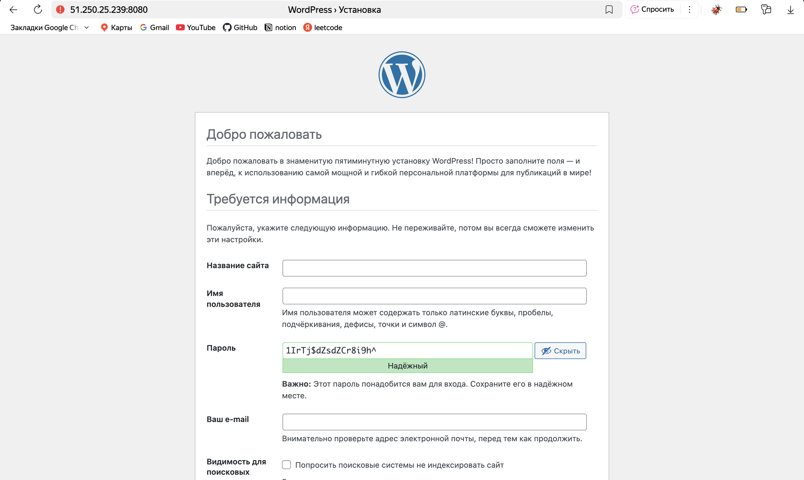

# HW1. Деплой WordPress + MariaDB через Ansible

Цель развернуть WordPress и MariaDB в отдельных контейнерах Docker, управление только Ansible, без bash-скриптов. Идемпотентность, секреты через Vault, проверки готовности сервисов

## Окружение

* Control node MacOS, установлен ansible-core и ansible-galaxy
* Managed node Ubuntu 22.04/24.04 в Yandex Cloud, `x86_64`
* Доступ по SSH ключом, Python на целевом уже есть

## Архитектура решения

* Docker ставится ролью на target
* Выделенная docker-сеть bridge для сервисов
* Контейнер БД MariaDB, без публикации порта наружу, persistent volume
* Контейнер WordPress, публикация HTTP на 8080, persistent volume
* Healthcheck у БД, ожидание состояния healthy перед стартом WP
* Проверка HTTP WP через модуль uri, допустимые статусы 200 301 302
* Теги ролей docker, network, db, wp

## Структура репозитория

* ansible.cfg с путями ролей, инвентори, форматированием вывода
* inventory.yml с группой carrier и хостом yc-wp-1
* requirements.yml с коллекциями community.docker и ansible.posix
* `group_vars/carrier/main.yml` обычные переменные
* `group_vars/carrier/vault.yml` зашифрованные переменные
* roles/docker установка и запуск Docker CE
* roles/network создание docker-сети
* roles/db запуск MariaDB с томом, env, healthcheck
* roles/wordpress запуск WordPress с томом и публикацией порта
* playbook1.yml последовательность `pre_tasks` роли ожидания и проверки

## Переменные

* Флаг `is_wordpress` включает или выключает развертывание WP
* Имена сети и контейнеров `docker_network_name`, `wp_container_name`, `db_container_name`
* Базовые образы `wp_image`, `db_image`
* Порты `wordpress_port` и внутренний `db_port`
* База и учетные записи `wordpress_db_name`,`wordpress_db_user`
* Имена томов `wp_volume`, `db_volume`
* `db_host` равен имени контейнера БД для резолва внутри сети

## Секреты

* vault.yml хранит `db_root_password` и `wordpress_db_password`
* Запуск плейбука с запросом пароля Vault
* В репозиторий пароли и ключи не попадают

## Поток выполнения плейбука

1. Сбор фактов, вывод целевого хоста
2. Роль docker, установка пакетов и запуск демона
3. Роль network, создание сети
4. Роль db, том данных, контейнер, healthcheck
5. Ожидание статуса healthy у контейнера БД
6. Роль wordpress по условию is_wordpress
7. Ожидание HTTP ответа WP
8. Вывод итогового URL вида http\://<ip>:<порт>

## Идемпотентность

* Первый прогон изменит состояние, установка докера, создание сети, контейнеров, томов
* Второй прогон должен показать changed 0
* Если есть ложные изменения, проверяются места без явных критериев идемпотентности, например необоснованный command без creates, нестабильные переменные контейнера, плавающие теги образов

## Проверки

* HTTP редирект на /wp-admin/install.php допускается, это нормальная стартовая страница WP
* Порт БД наружу не открыт, доступ только по внутренней сети docker
* Тома существуют, повторный запуск не теряет данные

## Ограничения и пининг

* Для воспроизводимости образы фиксируются по тегам, при необходимости по digest
* Ресурсы контейнеров могут быть ограничены по памяти и CPU на уровне роли, если требуется

## Частичные прогоны

* Теги позволяют адресно ставить докер, поднимать сеть и БД, поднимать WP отдельно
* Используются теги docker, network, db, wp

## Отладка

* Если переменные не подхватываются, проверяется конфликт файла group_vars/carrier.yml и каталога group_vars/carrier. Используется каталог, файл игнорируется. Итоговая схема main.yml + vault.yml внутри каталога
* Ошибка community.docker.docker_network name undefined указывает на отсутствие docker_network_name в зоне видимости группы
* Предупреждение про старый yaml callback устранено заменой на stdout_callback default и result_format yaml в ansible.cfg


## Что именно менялось по ходу

* Установка ansible-core и ansible-galaxy на Mac, исправление brew-окружения
* Создание инвентори с хостом YC, перенос переменных из group_vars/carrier.yml в group_vars/carrier/main.yml из-за конфликта файл-каталог
* Создание vault.yml и ввод секретов через ansible-vault
* Исправление ansible.cfg для нового stdout и yaml-формата
* Первичный прогон с changed 5, повторный прогон идемпотентный
* Фактическая проверка HTTP 302 на /wp-admin/install.php, что подтверждает рабочий Apache PHP и WP


## Проверки работоспособности

### Открываем в браузере



### Проверка доступности WordPress по HTTP

kirilldikalin@MacBook-Air-Kirill-2 IFMO_DistributedComputing_for_DevOps % curl -I http://51.250.25.239:8080 || true
HTTP/1.1 302 Found
Date: Wed, 17 Sep 2025 13:32:49 GMT
Server: Apache/2.4.62 (Debian)
X-Powered-By: PHP/8.2.25
Expires: Wed, 11 Jan 1984 05:00:00 GMT
Cache-Control: no-cache, must-revalidate, max-age=0
X-Redirect-By: WordPress
Location: http://51.250.25.239:8080/wp-admin/install.php
Content-Type: text/html; charset=UTF-8


### Контейнеры на целевой ВМ

kirilldikalin@MacBook-Air-Kirill-2 IFMO_DistributedComputing_for_DevOps % `ssh -i ~/.ssh/itmo/itmo_key distributedadmin@51.250.25.239`

distributedadmin@compute-vm-distributed-computing:~$ `sudo docker ps`
CONTAINER ID   IMAGE                  COMMAND                  CREATED          STATUS                    PORTS                  NAMES
a33dcaad7ebf   wordpress:6.6-apache   "docker-entrypoint.s…"   17 minutes ago   Up 17 minutes             0.0.0.0:8080->80/tcp   wp-app
9f2a8c6d235b   mariadb:10.11          "docker-entrypoint.s…"   18 minutes ago   Up 18 minutes (healthy)   3306/tcp               wp-db

### Логи котейнеров

distributedadmin@compute-vm-distributed-computing:~$ `sudo docker logs wp-app --tail 20`

```
91.84.102.156 - - [17/Sep/2025:13:47:48 +0000] "GET /wp-includes/js/jquery/jquery.min.js?ver=3.7.1 HTTP/1.1" 200 30715 "http://51.250.25.239:8080/wp-admin/install.php" "Mozilla/5.0 (Macintosh; Intel Mac OS X 10_15_7) AppleWebKit/537.36 (KHTML, like Gecko) Chrome/138.0.0.0 YaBrowser/25.8.0.0 Safari/537.36"
91.84.102.156 - - [17/Sep/2025:13:47:48 +0000] "GET /wp-admin/images/wordpress-logo.svg?ver=20131107 HTTP/1.1" 200 1810 "http://51.250.25.239:8080/wp-admin/css/install.min.css?ver=6.6.2" "Mozilla/5.0 (Macintosh; Intel Mac OS X 10_15_7) AppleWebKit/537.36 (KHTML, like Gecko) Chrome/138.0.0.0 YaBrowser/25.8.0.0 Safari/537.36"
91.84.102.156 - - [17/Sep/2025:13:47:48 +0000] "GET /wp-admin/images/spinner-2x.gif HTTP/1.1" 200 7822 "http://51.250.25.239:8080/wp-admin/css/install.min.css?ver=6.6.2" "Mozilla/5.0 (Macintosh; Intel Mac OS X 10_15_7) AppleWebKit/537.36 (KHTML, like Gecko) Chrome/138.0.0.0 YaBrowser/25.8.0.0 Safari/537.36"
91.84.102.156 - - [17/Sep/2025:13:47:48 +0000] "GET /favicon.ico HTTP/1.1" 302 408 "http://51.250.25.239:8080/wp-admin/install.php" "Mozilla/5.0 (Macintosh; Intel Mac OS X 10_15_7) AppleWebKit/537.36 (KHTML, like Gecko) Chrome/138.0.0.0 YaBrowser/25.8.0.0 Safari/537.36"
91.84.102.156 - - [17/Sep/2025:13:47:48 +0000] "GET /wp-admin/install.php HTTP/1.1" 200 4661 "http://51.250.25.239:8080/wp-admin/install.php" "Mozilla/5.0 (Macintosh; Intel Mac OS X 10_15_7) AppleWebKit/537.36 (KHTML, like Gecko) Chrome/138.0.0.0 YaBrowser/25.8.0.0 Safari/537.36"
91.84.102.156 - - [17/Sep/2025:13:47:49 +0000] "GET /favicon.ico HTTP/1.1" 302 408 "http://51.250.25.239:8080/wp-admin/install.php" "Mozilla/5.0 (Macintosh; Intel Mac OS X 10_15_7) AppleWebKit/537.36 (KHTML, like Gecko) Chrome/138.0.0.0 YaBrowser/25.8.0.0 Safari/537.36"
91.84.102.156 - - [17/Sep/2025:13:47:49 +0000] "GET /wp-admin/install.php HTTP/1.1" 200 4661 "http://51.250.25.239:8080/wp-admin/install.php" "Mozilla/5.0 (Macintosh; Intel Mac OS X 10_15_7) AppleWebKit/537.36 (KHTML, like Gecko) Chrome/138.0.0.0 YaBrowser/25.8.0.0 Safari/537.36"
127.0.0.1 - - [17/Sep/2025:13:47:54 +0000] "OPTIONS * HTTP/1.0" 200 126 "-" "Apache/2.4.62 (Debian) PHP/8.2.25 (internal dummy connection)"
127.0.0.1 - - [17/Sep/2025:13:47:55 +0000] "OPTIONS * HTTP/1.0" 200 126 "-" "Apache/2.4.62 (Debian) PHP/8.2.25 (internal dummy connection)"
127.0.0.1 - - [17/Sep/2025:13:47:56 +0000] "OPTIONS * HTTP/1.0" 200 126 "-" "Apache/2.4.62 (Debian) PHP/8.2.25 (internal dummy connection)"
91.84.102.156 - - [17/Sep/2025:13:47:57 +0000] "POST /wp-admin/install.php?step=1 HTTP/1.1" 200 3994 "http://51.250.25.239:8080/wp-admin/install.php" "Mozilla/5.0 (Macintosh; Intel Mac OS X 10_15_7) AppleWebKit/537.36 (KHTML, like Gecko) Chrome/138.0.0.0 YaBrowser/25.8.0.0 Safari/537.36"
91.84.102.156 - - [17/Sep/2025:13:47:59 +0000] "GET /wp-includes/js/zxcvbn-async.min.js?ver=1.0 HTTP/1.1" 200 598 "http://51.250.25.239:8080/wp-admin/install.php?step=1" "Mozilla/5.0 (Macintosh; Intel Mac OS X 10_15_7) AppleWebKit/537.36 (KHTML, like Gecko) Chrome/138.0.0.0 YaBrowser/25.8.0.0 Safari/537.36"
91.84.102.156 - - [17/Sep/2025:13:47:59 +0000] "GET /wp-includes/js/dist/hooks.min.js?ver=2810c76e705dd1a53b18 HTTP/1.1" 200 1886 "http://51.250.25.239:8080/wp-admin/install.php?step=1" "Mozilla/5.0 (Macintosh; Intel Mac OS X 10_15_7) AppleWebKit/537.36 (KHTML, like Gecko) Chrome/138.0.0.0 YaBrowser/25.8.0.0 Safari/537.36"
91.84.102.156 - - [17/Sep/2025:13:47:59 +0000] "GET /wp-admin/js/user-profile.min.js?ver=6.6.2 HTTP/1.1" 200 2824 "http://51.250.25.239:8080/wp-admin/install.php?step=1" "Mozilla/5.0 (Macintosh; Intel Mac OS X 10_15_7) AppleWebKit/537.36 (KHTML, like Gecko) Chrome/138.0.0.0 YaBrowser/25.8.0.0 Safari/537.36"
91.84.102.156 - - [17/Sep/2025:13:47:59 +0000] "GET /wp-includes/js/dist/i18n.min.js?ver=5e580eb46a90c2b997e6 HTTP/1.1" 200 4012 "http://51.250.25.239:8080/wp-admin/install.php?step=1" "Mozilla/5.0 (Macintosh; Intel Mac OS X 10_15_7) AppleWebKit/537.36 (KHTML, like Gecko) Chrome/138.0.0.0 YaBrowser/25.8.0.0 Safari/537.36"
91.84.102.156 - - [17/Sep/2025:13:47:59 +0000] "GET /wp-admin/js/password-strength-meter.min.js?ver=6.6.2 HTTP/1.1" 200 964 "http://51.250.25.239:8080/wp-admin/install.php?step=1" "Mozilla/5.0 (Macintosh; Intel Mac OS X 10_15_7) AppleWebKit/537.36 (KHTML, like Gecko) Chrome/138.0.0.0 YaBrowser/25.8.0.0 Safari/537.36"
91.84.102.156 - - [17/Sep/2025:13:47:59 +0000] "GET /wp-includes/js/wp-util.min.js?ver=6.6.2 HTTP/1.1" 200 1099 "http://51.250.25.239:8080/wp-admin/install.php?step=1" "Mozilla/5.0 (Macintosh; Intel Mac OS X 10_15_7) AppleWebKit/537.36 (KHTML, like Gecko) Chrome/138.0.0.0 YaBrowser/25.8.0.0 Safari/537.36"
91.84.102.156 - - [17/Sep/2025:13:47:59 +0000] "GET /wp-includes/js/underscore.min.js?ver=1.13.4 HTTP/1.1" 200 7656 "http://51.250.25.239:8080/wp-admin/install.php?step=1" "Mozilla/5.0 (Macintosh; Intel Mac OS X 10_15_7) AppleWebKit/537.36 (KHTML, like Gecko) Chrome/138.0.0.0 YaBrowser/25.8.0.0 Safari/537.36"
91.84.102.156 - - [17/Sep/2025:13:47:59 +0000] "GET /wp-includes/js/zxcvbn.min.js HTTP/1.1" 200 400393 "http://51.250.25.239:8080/wp-admin/install.php?step=1" "Mozilla/5.0 (Macintosh; Intel Mac OS X 10_15_7) AppleWebKit/537.36 (KHTML, like Gecko) Chrome/138.0.0.0 YaBrowser/25.8.0.0 Safari/537.36"
127.0.0.1 - - [17/Sep/2025:13:48:06 +0000] "OPTIONS * HTTP/1.0" 200 126 "-" "Apache/2.4.62 (Debian) PHP/8.2.25 (internal dummy connection)"
```

distributedadmin@compute-vm-distributed-computing:~$ `sudo docker logs wp-db --tail 20`

```
2025-09-17 13:31:01 0 [Note] mariadbd: O_TMPFILE is not supported on /tmp (disabling future attempts)
2025-09-17 13:31:01 0 [Warning] mariadbd: io_uring_queue_init() failed with EPERM: sysctl kernel.io_uring_disabled has the value 2, or 1 and the user of the process is not a member of sysctl kernel.io_uring_group. (see man 2 io_uring_setup).
create_uring failed: falling back to libaio
2025-09-17 13:31:01 0 [Note] InnoDB: Using Linux native AIO
2025-09-17 13:31:01 0 [Note] InnoDB: innodb_buffer_pool_size_max=128m, innodb_buffer_pool_size=128m
2025-09-17 13:31:01 0 [Note] InnoDB: Completed initialization of buffer pool
2025-09-17 13:31:01 0 [Note] InnoDB: File system buffers for log disabled (block size=4096 bytes)
2025-09-17 13:31:01 0 [Note] InnoDB: End of log at LSN=46980
2025-09-17 13:31:01 0 [Note] InnoDB: 128 rollback segments are active.
2025-09-17 13:31:01 0 [Note] InnoDB: Setting file './ibtmp1' size to 12.000MiB. Physically writing the file full; Please wait ...
2025-09-17 13:31:01 0 [Note] InnoDB: File './ibtmp1' size is now 12.000MiB.
2025-09-17 13:31:01 0 [Note] InnoDB: log sequence number 46980; transaction id 14
2025-09-17 13:31:01 0 [Note] InnoDB: Loading buffer pool(s) from /var/lib/mysql/ib_buffer_pool
2025-09-17 13:31:01 0 [Note] Plugin 'FEEDBACK' is disabled.
2025-09-17 13:31:01 0 [Warning] You need to use --log-bin to make --expire-logs-days or --binlog-expire-logs-seconds work.
2025-09-17 13:31:01 0 [Note] Server socket created on IP: '0.0.0.0', port: '3306'.
2025-09-17 13:31:01 0 [Note] Server socket created on IP: '::', port: '3306'.
2025-09-17 13:31:01 0 [Note] mariadbd: ready for connections.
Version: '10.11.14-MariaDB-ubu2204'  socket: '/run/mysqld/mysqld.sock'  port: 3306  mariadb.org binary distribution
2025-09-17 13:31:01 0 [Note] InnoDB: Buffer pool(s) load completed at 250917 13:31:01
```

### Проверка сети

distributedadmin@compute-vm-distributed-computing:~$ `sudo docker network inspect wpnet`

```json
[
    {
        "Name": "wpnet",
        "Id": "fba9515f89602da86dd81c5ee7515e1fcfeb49793d780748b1fa3a3ae104f373",
        "Created": "2025-09-17T13:30:29.862511298Z",
        "Scope": "local",
        "Driver": "bridge",
        "EnableIPv4": true,
        "EnableIPv6": false,
        "IPAM": {
            "Driver": "default",
            "Options": null,
            "Config": [
                {
                    "Subnet": "172.18.0.0/16",
                    "Gateway": "172.18.0.1"
                }
            ]
        },
        "Internal": false,
        "Attachable": false,
        "Ingress": false,
        "ConfigFrom": {
            "Network": ""
        },
        "ConfigOnly": false,
        "Containers": {
            "9f2a8c6d235bda4f22413447c00c2369c56af997a15d33e48aa0449a1bb03fcb": {
                "Name": "wp-db",
                "EndpointID": "56f90628d3db6318b1bb16f3f2982b216f07044621f86dd29f0c18b2c54d4f28",
                "MacAddress": "e6:f6:78:80:ec:1e",
                "IPv4Address": "172.18.0.2/16",
                "IPv6Address": ""
            },
            "a33dcaad7ebf0c295d96af32494bb32a572b865c792ff53932650a36b46f760f": {
                "Name": "wp-app",
                "EndpointID": "c2c200acf9f0effea441a18b41eaf7aec1372118b5940a1fb68fd108f5b7f892",
                "MacAddress": "ae:89:d3:be:bb:24",
                "IPv4Address": "172.18.0.3/16",
                "IPv6Address": ""
            }
        },
        "Options": {},
        "Labels": {}
    }
]
```

### healthcheck БД

distributedadmin@compute-vm-distributed-computing:~$ `sudo docker inspect -f '{{json .State.Health}}' wp-db | jq`


```json
{
  "Status": "healthy",
  "FailingStreak": 0,
  "Log": [
    {
      "Start": "2025-09-17T13:51:20.707493343Z",
      "End": "2025-09-17T13:51:20.75113992Z",
      "ExitCode": 0,
      "Output": "mysqld is alive\n"
    },
    {
      "Start": "2025-09-17T13:51:30.75193462Z",
      "End": "2025-09-17T13:51:30.797620479Z",
      "ExitCode": 0,
      "Output": "mysqld is alive\n"
    },
    {
      "Start": "2025-09-17T13:51:40.798166544Z",
      "End": "2025-09-17T13:51:40.8445318Z",
      "ExitCode": 0,
      "Output": "mysqld is alive\n"
    },
    {
      "Start": "2025-09-17T13:51:50.845484938Z",
      "End": "2025-09-17T13:51:50.894934589Z",
      "ExitCode": 0,
      "Output": "mysqld is alive\n"
    },
    {
      "Start": "2025-09-17T13:52:00.895953436Z",
      "End": "2025-09-17T13:52:00.940097703Z",
      "ExitCode": 0,
      "Output": "mysqld is alive\n"
    }
  ]
}
```
